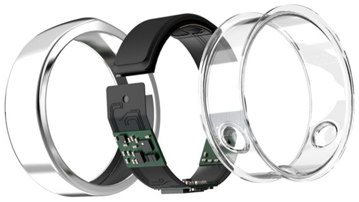
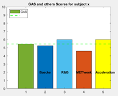

# Global-Activity-Score
Projet HAH913E 
Activité physique & Santé : Partie Mesure
----------------------------------------------
Calculation of an overall activity score to simplify the estimation of daily physical activities.

## Context
Ten years ago, only a few specialized brands offered athletes sensors to better analyze health data during training.Connected wristbands are now common for accurate sleep and activity information. But even without dedicated equipment, it is possible to use the sensors built into smartphones to provide essential information.

As part of a school project, we develop a concept application that estimates daily physical activity based on subjective and objective variables and informs the user about it with a single score out of 10, the Global Activity Score (GAS). 
This program calculates this score from:
- Subjective data collected via this form :
  https://forms.gle/7TvAGn3o9GjJeZeP9
  (Questionnaire created from Baecke Questionnaire, Ricci &Gagnon Questionnaire and MET number estimation Questionnaire)

- Objective data collected via a connected ring. Ideally we would like to create our own ring available in loan or rental for application users. At the moment, the solution marketed that comes closest to it is the «Oura Ring». It contains two infrared LED sensors (to calculate the heart rate), several temperature sensors, a 3D accelerometer and a gyroscope for a price of $300.


Since we do not have this accessory, we will limit ourselves to the use of an accelerometer lent by our professor. 


## Usage
- (Clone or) download the repository
- On your computer :
  - Open and run main.m with matlab
- For your users :
  - clone the form doc
  
## Code description
- `main` is the entry point
- `ScoresCalculation` takes care of calculating score from GoogleForm questions.

### ScoreCalculation
`ScoresCalculation` use the excel document that you can export with GoogleForm to extract :
- Baecke score from 17 to 78
- Ricci&Gagnon score from 6 to 45
- an estimation of MET number for principal activity sessions
- an estimation of MET number by week


### Collecting actimetry data
In the entry of the program, we used a .csv file which contains the data of the Activity AX3. The algorith create figure which represent the Activity measurement. Also in the figure, we can observe different treshold to isolate different degrees of activities and the period of high rythm of activities.

The device is composed by an accelerometer and a flash memory. Thanks a software, we can extract the data in a .cvs file. We can find in this file, the timeline and the accelerometer data in 3 axis (X,Y,Z)

In the program, we calculated the euclidienne norme of X Y Z. After that, we substracted 1 of the norm to remove the gravity. Also, we have made means of data every 10 minutes. Thanks thoses new data, we can have the activity and create tresholds.

We calculated when the user was in an intense, medium or light activity. We have etablished a score which use the type of the person(sportman, professionnal or novice) and the timing of his physical activities. This score is beetween 0 and 10.

### GAS
We chose to create the score based on the averages of the questionnaire results. However a different approach by giving more importance to one of the parameters could be considered.
```{matlab}
GASqcm =    (((ScoreMatrix(:,1)*10)/78) 
          + ((ScoreMatrix(:,2)*10)/45)
          + ((ScoreMatrix(:,5)*10)/34))
                                    /3;
```

Added to this, we note on 10 the ring activity measure according to the selected threshold. Thank a study with a Axivity AX3, we made some mesurement to develop our data in activities measurment. We create our own treshold beetween 0 and 10 for an entire day.


```{scilab}


```
We average the two results and display the score directly in the application.

NOTE : Other variables can be added, just set a score scale from 1 to 10.

## Exemple
Run `exemple.m`
Shows GAS in comparaison of all its variables for one subject.

NOTE: Recording was during school day
## TODO
### Adding GPS
With GPS information from the phone, we could estimate the number of kilometres travelled and thus add this parameter.

### Create a score based on the variability of the heart rate during the day
The heart rate is a good estimator of the intensity of a physical effort.
